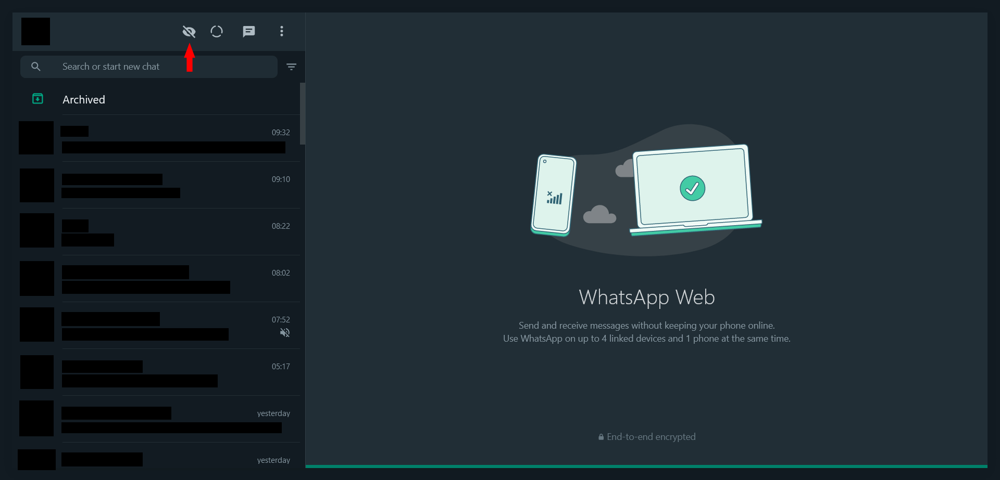
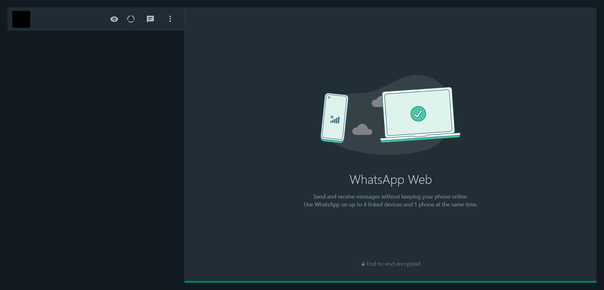

# WhatsApp Contacts Panel Hider

Small hack of a extension to hide contact list panel on WhatsApp Web.

[Avaiable for Firefox](https://addons.mozilla.org/en-US/firefox/addon/whatsapp-contacts-panel-hider/)

Not published for Chrome but it works over there too.

## Usage

This extension adds a new button to the UI which you can click to hide the side panel.

You can press the button again to unhide the side panel.

## References

- [Your First Extension - MDN](https://developer.mozilla.org/en-US/docs/Mozilla/Add-ons/WebExtensions/Your_first_WebExtension)
- [Content Scripts - MDN](https://developer.mozilla.org/en-US/docs/Mozilla/Add-ons/WebExtensions/Content_scripts)
- Icons from [Google Fonts](https://fonts.google.com/icons)
- [Getting started with web-ext](https://extensionworkshop.com/documentation/develop/getting-started-with-web-ext/)
