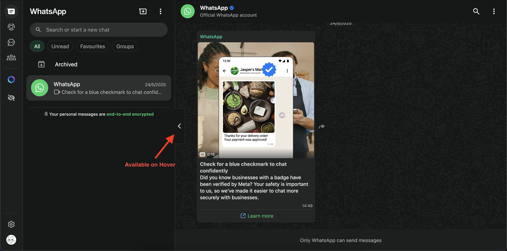
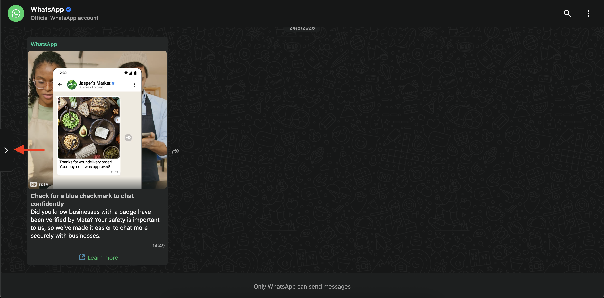

# WhatsApp Contacts Panel Hider

Small hack of a extension to hide/collapse contact list panel on WhatsApp Web.

[Avaiable for Firefox](https://addons.mozilla.org/en-US/firefox/addon/whatsapp-contacts-panel-hider/)

Not published for Chrome but it works over there too.

## Usage

### Hiding Contacts Panel

This extension adds a new button to the UI which you can click to hide the contact panel.


You can press the button again to unhide the side panel.

### Collapsing Left Panel

You can also collapse the whole left panel by hovering over and clicking on the button present on the right middle of left panel. **The button will not be visible without hover.**





You can press the button again to expand the left panel.

## Development

1. Install web-ext

```bash
  npm install --global web-ext
```

2. Build the extension

```bash
  web-ext build --ignore-files "./images" "README.md" -n whatsapp_contacts_panel_hider-${version}.zip
```

This will create a deployable zip file in `web-ext-artifacts` directory. You can install this zip file in Firefox manually.

All previous versions available in [web-ext-artifacts](./web-ext-artifacts) directory.

## References

- [Your First Extension - MDN](https://developer.mozilla.org/en-US/docs/Mozilla/Add-ons/WebExtensions/Your_first_WebExtension)
- [Content Scripts - MDN](https://developer.mozilla.org/en-US/docs/Mozilla/Add-ons/WebExtensions/Content_scripts)
- Icons from [Google Fonts](https://fonts.google.com/icons)
- [Getting started with web-ext](https://extensionworkshop.com/documentation/develop/getting-started-with-web-ext/)
